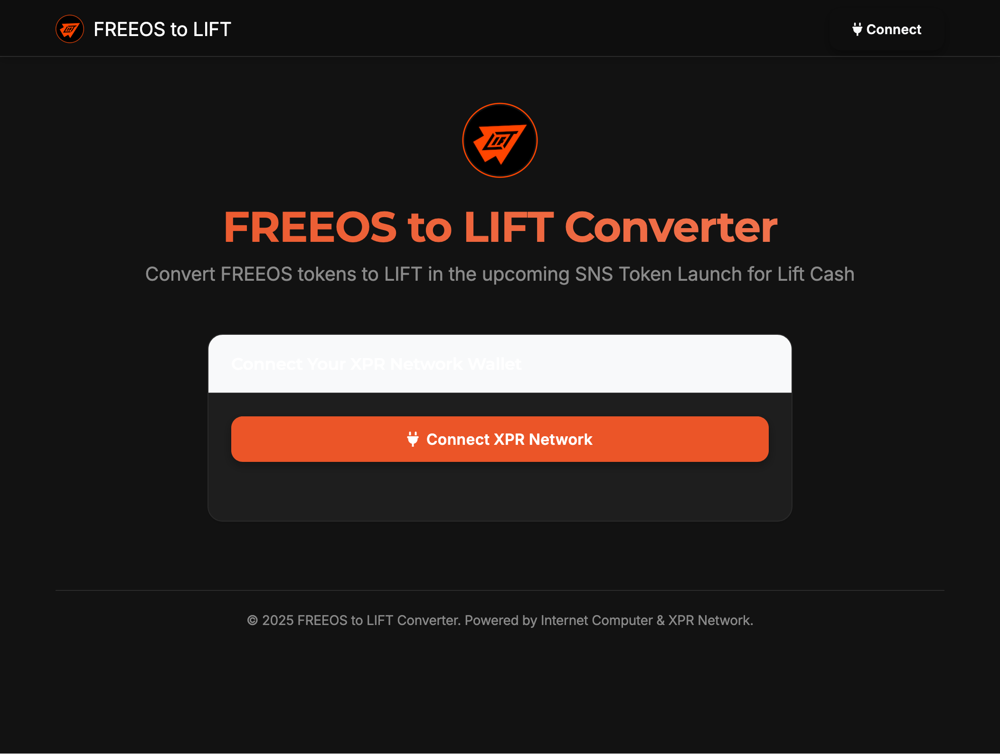
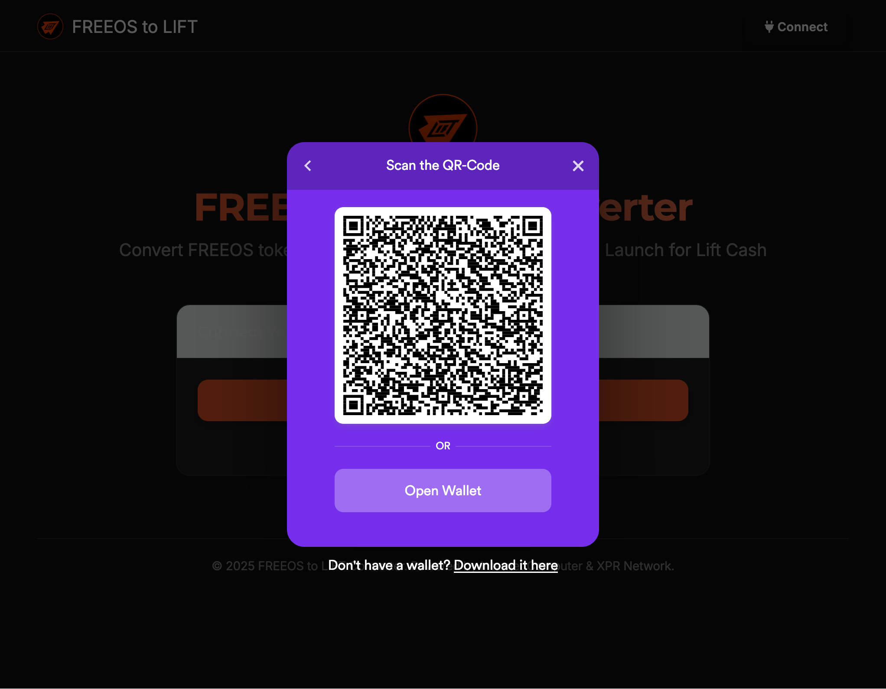
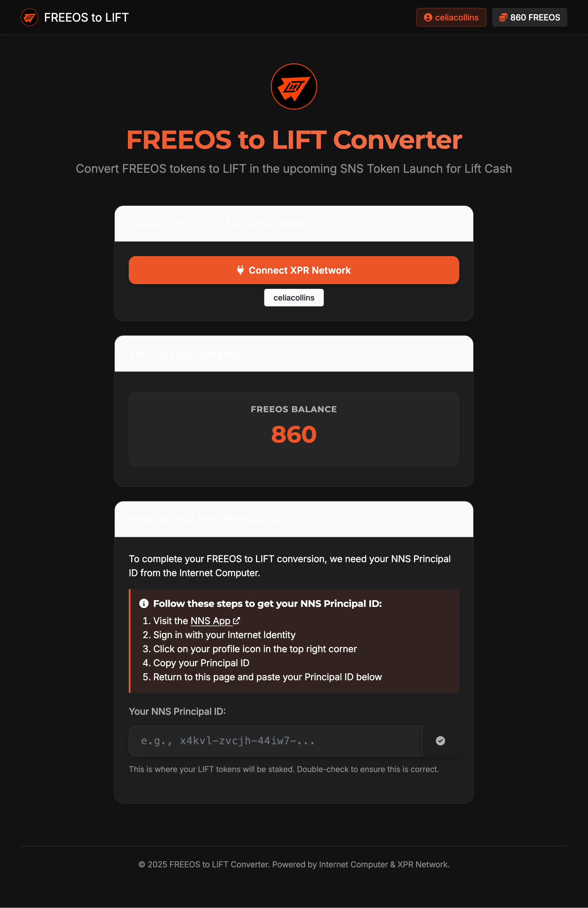
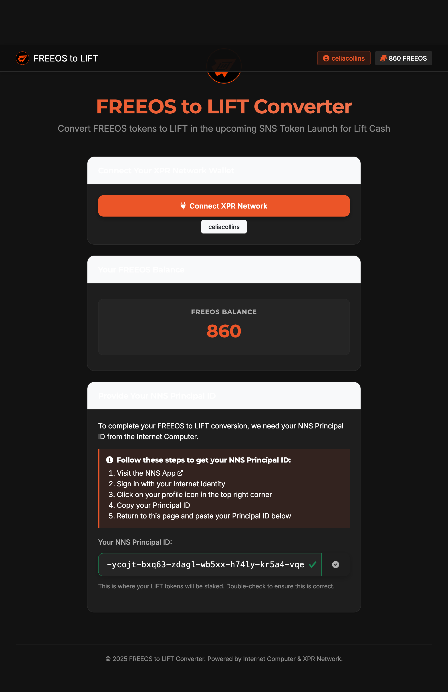
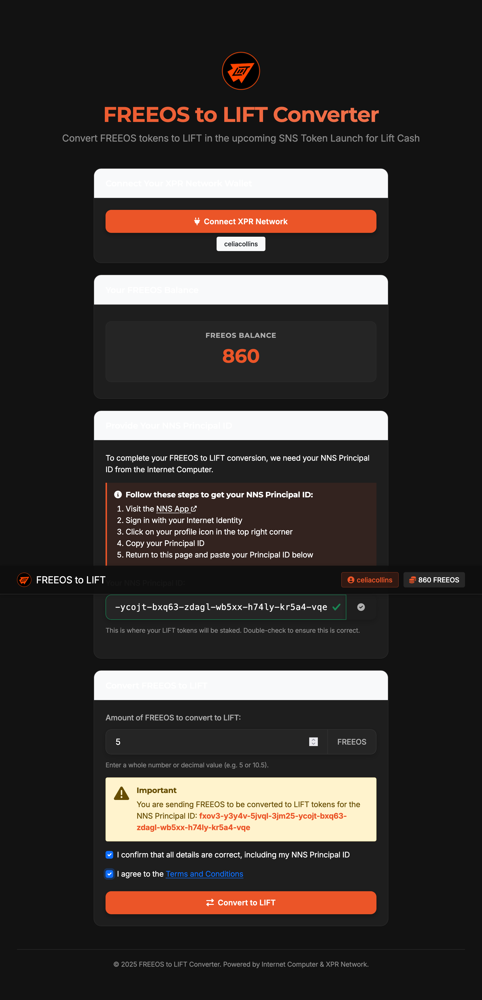
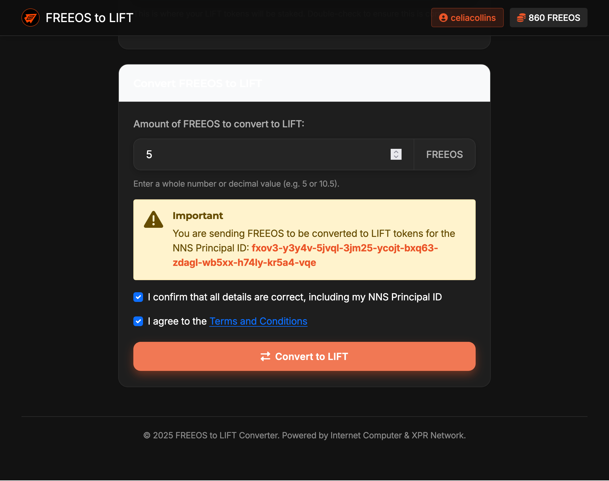
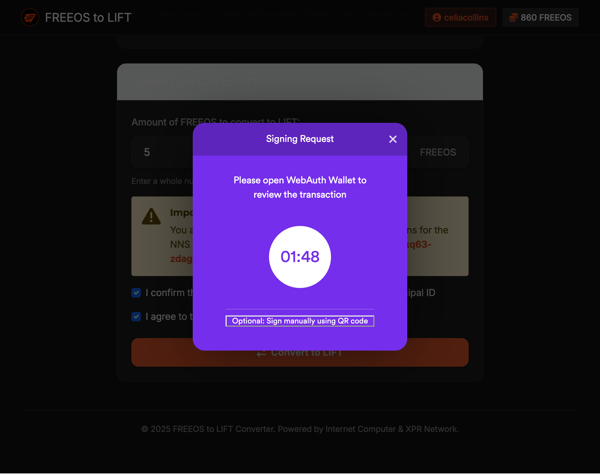
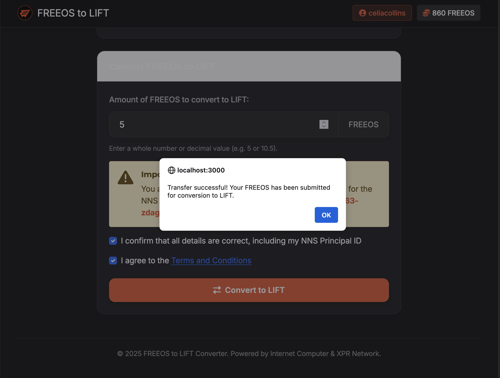

# FREEOS to LIFT Converter - User Manual

This guide provides step-by-step instructions for using the FREEOS to LIFT Converter dApp to convert your FREEOS tokens from the XPR Network to staked LIFT neurons on the Internet Computer.

## Contents

1. [Prerequisites](#prerequisites)
2. [Connecting Your XPR Network Wallet](#connecting-your-xpr-network-wallet)
3. [Getting Your NNS Principal ID](#getting-your-nns-principal-id)
4. [Converting FREEOS to LIFT](#converting-freeos-to-lift)
5. [Checking Your Conversion Status](#checking-your-conversion-status)
6. [Troubleshooting](#troubleshooting)
7. [FAQ](#faq)

## Prerequisites

Before you begin, ensure you have:

- A XPR Network wallet with FREEOS tokens
- An Internet Computer Network Nervous System (NNS) identity
- A modern web browser (Chrome, Firefox, Safari, or Edge)

## Connecting Your XPR Network Wallet

1. Visit the FREEOS to LIFT Converter dApp
2. Click the "Connect XPR Network" button in the card or in the top navigation bar
3. A QR code or wallet connection dialog will appear
4. Use your XPR Network wallet to scan the QR code or click "Open Wallet"

Once connected, you'll see your XPR Network account address in the navbar and your FREEOS balance displayed on the page.

## Getting Your NNS Principal ID

To receive your LIFT tokens, you need to provide your NNS Principal ID from the Internet Computer:

1. After connecting your XPR Network wallet, you'll see instructions for obtaining your NNS Principal ID
2. Click on the provided "NNS App" link to open the NNS App (https://nns.ic0.app/) in a new tab
3. Connect to the NNS App using your Internet Identity
4. Once logged in, click on your profile icon in the top-right corner
5. Your Principal ID will be displayed - copy it
6. Return to the FREEOS to LIFT Converter dApp
7. Paste your Principal ID into the input field
8. The system will validate your Principal ID format (green checkmark appears if valid)

## Converting FREEOS to LIFT

Once you've connected your XPR Network wallet and provided your NNS Principal ID:

1. Enter the amount of FREEOS you wish to convert to LIFT
2. Review the warning message showing your NNS Principal ID to ensure it's correct
3. Check the confirmation box to verify all details are correct
4. Review and accept the Terms and Conditions by checking the second box
5. Click the "Convert to LIFT" button
6. Confirm the transaction in your XPR Network wallet when prompted

Upon successful transaction, you'll receive a confirmation message:

## Checking Your Conversion Status

After completing your conversion request:

1. Your FREEOS tokens will be transferred immediately
2. Your balance in the dApp will update automatically
3. Your LIFT tokens will be created as staked neurons in the Lift Cash SNS DAO upon successful SNS launch

Note: If the SNS launch is not successful, your FREEOS tokens will be returned to their original XPR Network accounts automatically.

## Troubleshooting

### Common Issues

- **Wallet not connecting**: Ensure your wallet is unlocked and refresh the page
- **Principal ID not validating**: Check for any spaces or special characters that might have been copied
- **Transaction failing**: Verify you have enough FREEOS tokens and a small amount of XPR for transaction fees
- **QR code timing out**: If the QR code expires, simply click the Connect button again

If you continue to experience issues, please contact support at support@example.com.

## FAQ

**Q: When will I receive my LIFT tokens?**
A: LIFT tokens will be created as staked neurons in the Lift Cash SNS DAO upon successful SNS launch.

**Q: What happens if the SNS Launch doesn't proceed?**
A: In that case, all FREEOS tokens will be returned to their original XPR Network accounts.

**Q: How long will my LIFT tokens be staked for?**
A: Your LIFT tokens will be staked as neurons with specific dissolve delays determined by the SNS launch parameters.

**Q: What is the conversion ratio of FREEOS to LIFT?**
A: The exact conversion ratio will be determined prior to the SNS launch and communicated to all participants.

**Q: Can I cancel my conversion after submitting it?**
A: Once your transaction is confirmed on the blockchain, it cannot be reversed or cancelled.